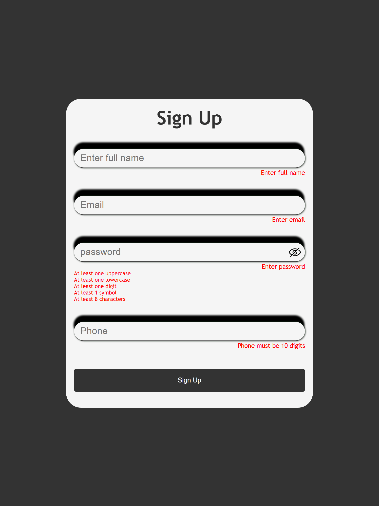

# 🔐 Secure Sign Up Form with Strict Password Validation

A client side form validation with robust password requirements, built with HTML, CSS, and JavaScript.



## ✨ Features
- **Full name validation** (requires first + last name)
- **Email format verification** (standard email pattern)
- **Strict password rules**:
  - At least **8 characters**
  - **1 uppercase** letter
  - **1 lowercase** letter
  - **1 number** (digit)
  - **1 special character** 
- **Phone number verification**
- **Hide/Show password**
- Real-time validation feedback
- Clean, user-friendly error messages

## 🛠️ Tech stack
### HTML5
### CSS3
### JavaScript
 - Regular Expression
### [Deployment]() [vercel]


## 🚀 Quick Start
No installation needed - runs directly in browser!

 Clone the repo:
   ```bash
   git clone https://github.com/Obiorakingsley/Signup-form.git